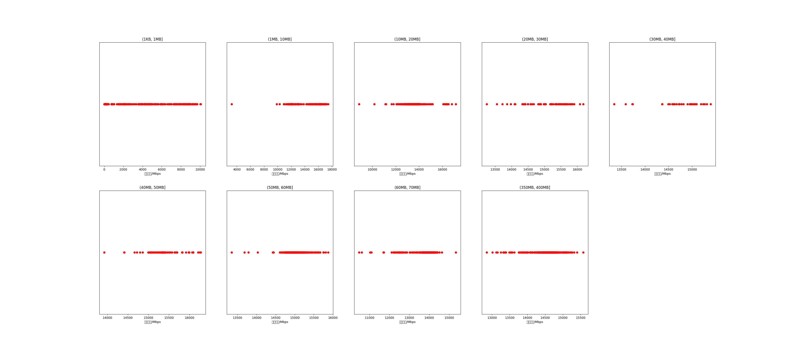

|   |个数|平均大小/MB|速率/Mbps|总时间/s|平均时间/ms|时间占比|
|---|---|---|---|---|---|---|
|(1KB, 1MB]|926|0.20|1764.12|1.61|1.74|0.73%|
|(1MB, 10MB]|181|4.88|14277.04|0.70|3.89|0.32%|
|(10MB, 20MB]|529|15.58|13534.36|7.33|13.86|3.32%|
|(20MB, 30MB]|69|25.52|15098.43|1.40|20.25|0.63%|
|(30MB, 40MB]|35|36.63|14729.71|1.05|29.87|0.47%|
|(40MB, 50MB]|77|46.98|15349.62|2.83|36.77|1.28%|
|(50MB, 60MB]|364|54.78|15018.56|15.94|43.79|7.23%|
|(60MB, 70MB]|500|64.00|13774.43|27.93|55.85|12.66%|
|(350MB, 400MB]|500|392.00|14549.85|161.76|323.51|73.35%|

