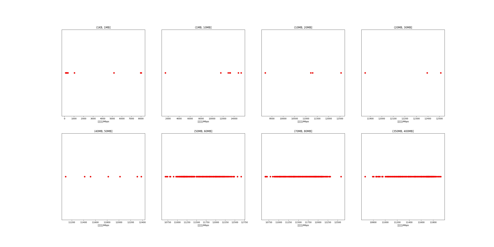

|   |个数|平均大小/MB|速率/Mbps|总时间/s|平均时间/ms|时间占比|
|---|---|---|---|---|---|---|
|(1KB, 1MB]|11|0.29|2156.24|0.03|2.62|0.02%|
|(1MB, 10MB]|8|5.44|11985.22|0.05|5.79|0.03%|
|(10MB, 20MB]|4|12.85|11067.15|0.06|14.46|0.04%|
|(20MB, 30MB]|3|27.73|12254.17|0.08|27.19|0.05%|
|(40MB, 50MB]|7|46.93|11794.01|0.34|47.86|0.20%|
|(50MB, 60MB]|291|56.15|11628.36|16.88|58.02|10.23%|
|(70MB, 80MB]|300|79.66|11582.76|24.79|82.63|15.02%|
|(350MB, 400MB]|300|392.00|11496.06|122.83|409.42|74.42%|

