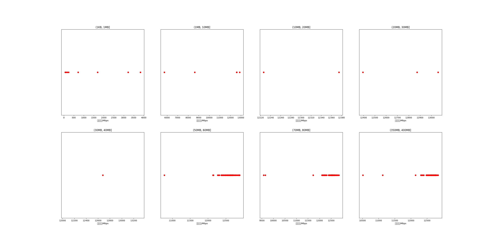

|   |个数|平均大小/MB|速率/Mbps|总时间/s|平均时间/ms|时间占比|
|---|---|---|---|---|---|---|
|(1KB, 1MB]|9|0.13|1129.34|0.01|0.94|0.02%|
|(1MB, 10MB]|5|4.70|10491.85|0.03|5.11|0.05%|
|(10MB, 20MB]|2|18.01|12300.65|0.04|17.58|0.07%|
|(20MB, 30MB]|3|25.44|12776.23|0.07|23.82|0.14%|
|(30MB, 40MB]|1|36.02|12678.70|0.03|34.09|0.07%|
|(50MB, 60MB]|97|56.12|12572.58|5.20|53.58|10.30%|
|(70MB, 80MB]|100|79.66|12423.36|7.71|77.07|15.28%|
|(350MB, 400MB]|100|392.00|12593.95|37.37|373.73|74.08%|

