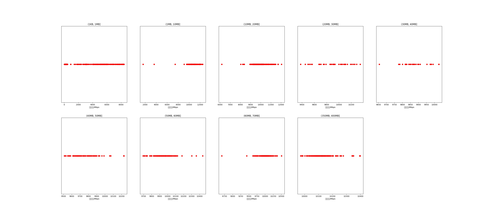

|   |个数|平均大小/MB|速率/Mbps|总时间/s|平均时间/ms|时间占比|
|---|---|---|---|---|---|---|
|(1KB, 1MB]|615|0.20|2018.16|0.63|1.02|0.33%|
|(1MB, 10MB]|122|7.11|10696.93|0.98|7.99|0.52%|
|(10MB, 20MB]|327|15.78|9824.55|6.33|19.37|3.35%|
|(20MB, 30MB]|39|26.45|9910.60|1.25|31.99|0.66%|
|(30MB, 40MB]|30|37.40|9875.25|1.36|45.45|0.72%|
|(40MB, 50MB]|84|46.65|9749.29|4.82|57.43|2.55%|
|(50MB, 60MB]|169|55.18|9948.29|11.25|66.57|5.95%|
|(60MB, 70MB]|300|64.00|10000.07|23.04|76.82|12.19%|
|(350MB, 400MB]|300|392.00|10121.34|139.43|464.78|73.74%|

