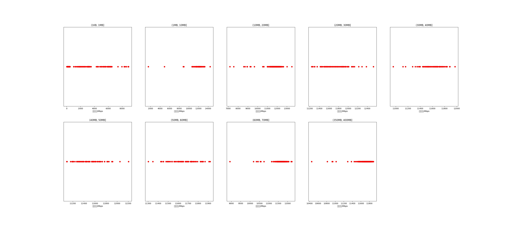

|   |个数|平均大小/MB|速率/Mbps|总时间/s|平均时间/ms|时间占比|
|---|---|---|---|---|---|---|
|(1KB, 1MB]|529|0.10|1323.37|0.39|0.73|0.24%|
|(1MB, 10MB]|97|7.95|11810.28|0.78|8.06|0.48%|
|(10MB, 20MB]|374|16.07|11724.80|6.17|16.51|3.79%|
|(20MB, 30MB]|98|25.87|11744.89|2.59|26.41|1.59%|
|(30MB, 40MB]|99|37.39|11594.59|3.83|38.70|2.35%|
|(40MB, 50MB]|80|46.91|11499.14|3.92|48.97|2.40%|
|(50MB, 60MB]|85|55.41|11659.24|4.85|57.04|2.97%|
|(60MB, 70MB]|300|64.00|11638.09|19.81|66.04|12.16%|
|(350MB, 400MB]|300|392.00|11699.65|120.64|402.13|74.02%|

