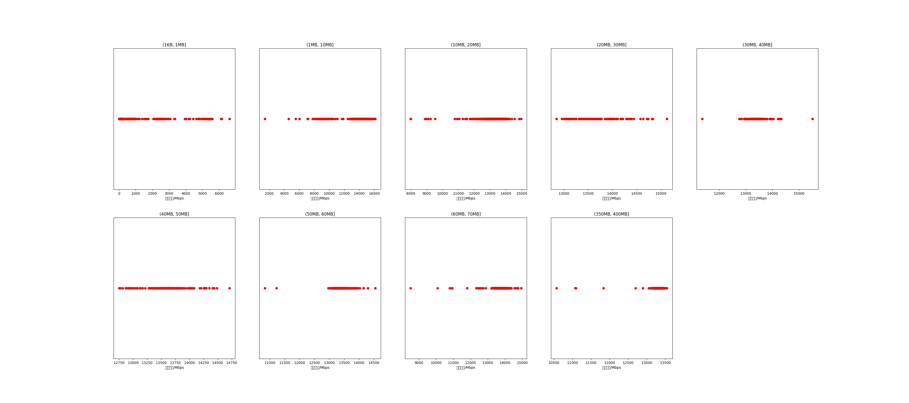

|   |个数|平均大小/MB|速率/Mbps|总时间/s|平均时间/ms|时间占比|
|---|---|---|---|---|---|---|
|(1KB, 1MB]|866|0.10|533.58|2.01|2.32|0.84%|
|(1MB, 10MB]|230|6.20|13057.86|1.27|5.54|0.53%|
|(10MB, 20MB]|585|15.85|13172.67|8.49|14.51|3.54%|
|(20MB, 30MB]|116|25.91|13687.24|2.63|22.70|1.10%|
|(30MB, 40MB]|105|37.09|13418.70|3.49|33.20|1.46%|
|(40MB, 50MB]|138|47.26|13600.98|5.76|41.75|2.41%|
|(50MB, 60MB]|214|54.62|13415.98|10.46|48.88|4.37%|
|(60MB, 70MB]|500|64.00|13687.59|28.10|56.20|11.73%|
|(350MB, 400MB]|500|392.00|13270.71|177.29|354.57|74.02%|

