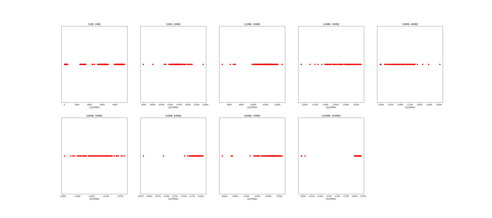

|   |个数|平均大小/MB|速率/Mbps|总时间/s|平均时间/ms|时间占比|
|---|---|---|---|---|---|---|
|(1KB, 1MB]|990|0.24|2553.11|0.75|0.75|0.28%|
|(1MB, 10MB]|167|7.03|11370.20|1.24|7.42|0.47%|
|(10MB, 20MB]|566|15.88|11029.00|9.79|17.30|3.71%|
|(20MB, 30MB]|109|25.69|11732.49|2.86|26.24|1.08%|
|(30MB, 40MB]|94|37.37|11603.10|3.63|38.66|1.38%|
|(40MB, 50MB]|116|46.53|12042.79|5.38|46.37|2.04%|
|(50MB, 60MB]|251|54.95|11876.56|13.94|55.53|5.28%|
|(60MB, 70MB]|500|64.00|12165.45|31.58|63.16|11.97%|
|(350MB, 400MB]|500|392.00|12089.56|194.57|389.15|73.77%|

