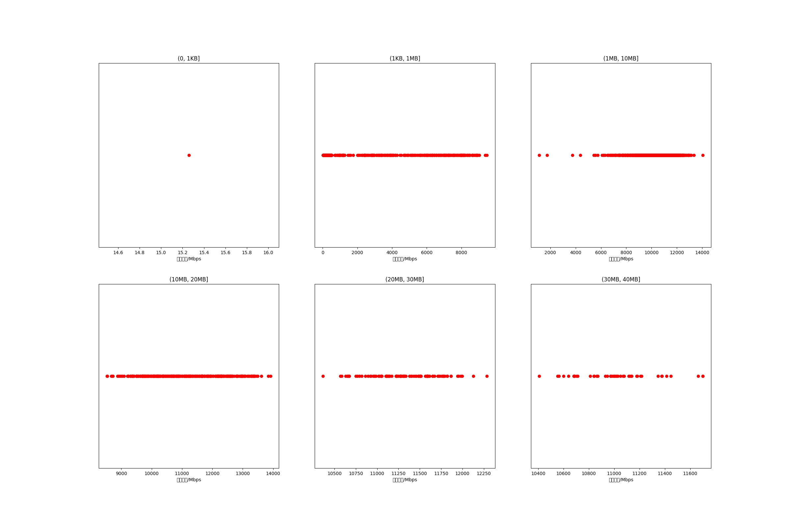

|   |个数|平均大小/MB|速率/Mbps|总时间/s|平均时间/ms|时间占比|
|---|---|---|---|---|---|---|
|(0, 1KB]|1|0.00|15.26|0.00|0.38|0.00%|
|(1KB, 1MB]|2376|0.08|865.42|1.46|0.61|4.28%|
|(1MB, 10MB]|4416|4.47|10519.25|22.54|5.10|66.16%|
|(10MB, 20MB]|378|13.29|11183.01|5.47|14.46|16.04%|
|(20MB, 30MB]|104|26.81|11314.71|2.96|28.50|8.70%|
|(30MB, 40MB]|48|31.31|11004.57|1.64|34.17|4.81%|

