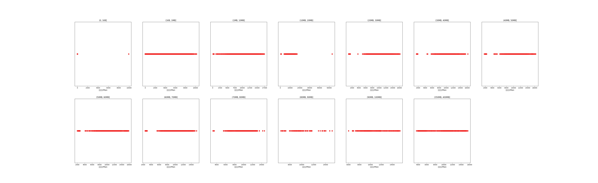

|   |个数|平均大小/MB|速率/Mbps|总时间/s|平均时间/ms|时间占比|
|---|---|---|---|---|---|---|
|(1KB, 1MB]|2185|0.05|732.81|1.09|0.50|0.62%|
|(1MB, 10MB]|1853|7.10|10558.27|15.02|8.10|8.60%|
|(10MB, 20MB]|349|15.65|10379.19|6.33|18.15|3.63%|
|(20MB, 30MB]|101|28.00|10823.60|3.13|31.04|1.79%|
|(60MB, 70MB]|300|64.00|10933.88|21.10|70.32|12.08%|
|(350MB, 400MB]|300|392.00|11028.88|128.02|426.75|73.29%|

