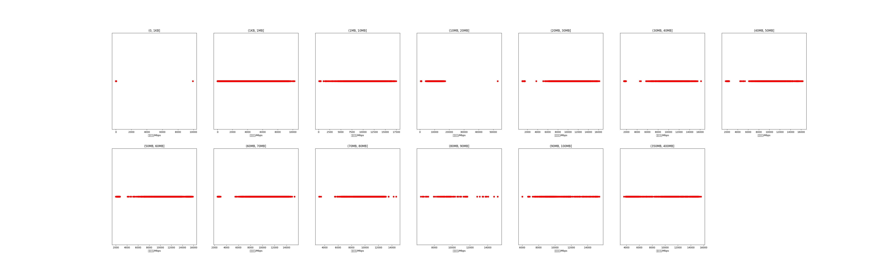

|   |个数|平均大小/MB|速率/Mbps|总时间/s|平均时间/ms|时间占比|
|---|---|---|---|---|---|---|
|(1KB, 1MB]|2604|0.10|1128.70|1.58|0.61|2.85%|
|(1MB, 10MB]|6267|4.91|10712.19|34.69|5.53|62.41%|
|(10MB, 20MB]|955|13.75|11071.68|14.28|14.95|25.69%|
|(20MB, 30MB]|118|26.00|11042.29|3.34|28.29|6.01%|
|(30MB, 40MB]|49|31.31|10917.07|1.69|34.45|3.04%|

