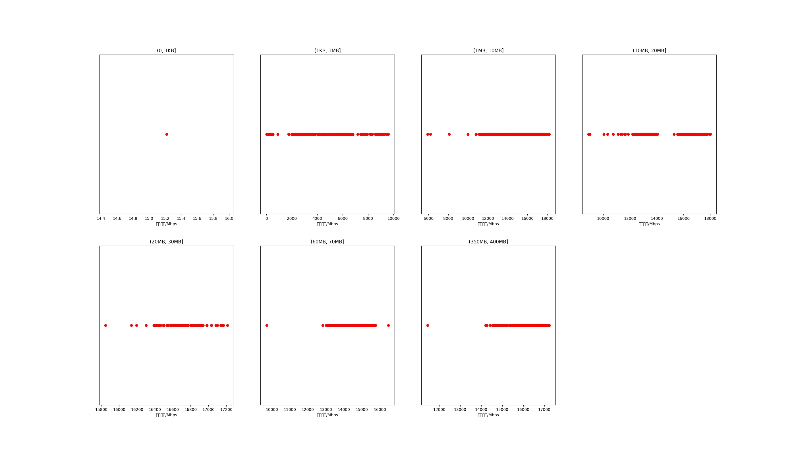

|   |个数|平均大小/MB|速率/Mbps|总时间/s|平均时间/ms|时间占比|
|---|---|---|---|---|---|---|
|(0, 1KB]|1|0.00|15.22|0.00|0.39|0.00%|
|(1KB, 1MB]|3439|0.05|607.72|2.24|0.65|1.12%|
|(1MB, 10MB]|3150|7.34|15794.42|17.19|5.46|8.55%|
|(10MB, 20MB]|650|15.11|14036.31|8.54|13.13|4.24%|
|(20MB, 30MB]|100|28.04|16700.86|2.01|20.15|1.00%|
|(60MB, 70MB]|500|64.00|15046.61|25.57|51.13|12.71%|
|(350MB, 400MB]|500|392.00|16177.94|145.58|291.16|72.38%|

