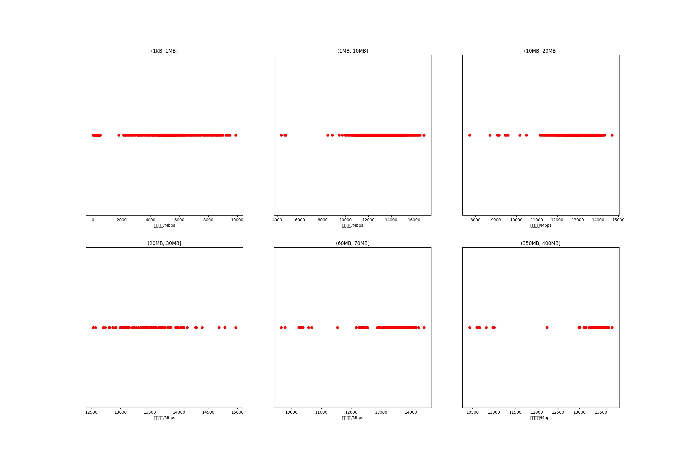

|   |个数|平均大小/MB|速率/Mbps|总时间/s|平均时间/ms|时间占比|
|---|---|---|---|---|---|---|
|(1KB, 1MB]|4073|0.05|634.71|2.80|0.69|1.17%|
|(1MB, 10MB]|3358|7.23|13336.28|21.76|6.48|9.08%|
|(10MB, 20MB]|550|15.64|12960.25|8.00|14.55|3.34%|
|(20MB, 30MB]|100|28.08|13498.61|2.50|24.98|1.04%|
|(60MB, 70MB]|500|64.00|13403.31|28.70|57.40|11.98%|
|(350MB, 400MB]|500|392.00|13392.63|175.76|351.51|73.38%|

