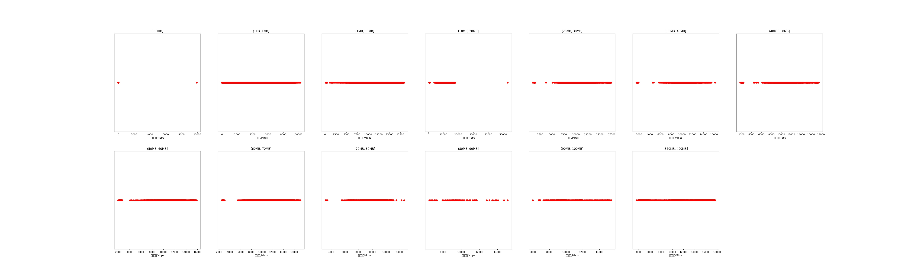

|   |个数|平均大小/MB|速率/Mbps|总时间/s|平均时间/ms|时间占比|
|---|---|---|---|---|---|---|
|(1KB, 1MB]|2824|0.06|738.14|1.76|0.62|0.89%|
|(1MB, 10MB]|2271|7.19|16510.92|11.60|5.11|5.88%|
|(10MB, 20MB]|751|15.87|14126.38|10.27|13.68|5.21%|
|(20MB, 30MB]|101|28.00|16910.32|2.01|19.88|1.02%|
|(40MB, 50MB]|99|47.22|16866.83|3.33|33.69|1.69%|
|(60MB, 70MB]|500|64.00|15324.04|25.14|50.28|12.75%|
|(350MB, 400MB]|500|392.00|16479.81|143.05|286.09|72.55%|

