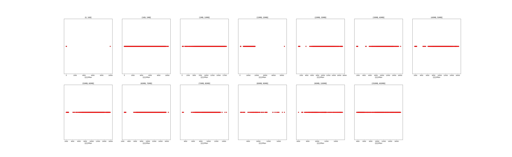

|   |个数|平均大小/MB|速率/Mbps|总时间/s|平均时间/ms|时间占比|
|---|---|---|---|---|---|---|
|(1KB, 1MB]|653|0.09|748.96|0.98|1.51|0.33%|
|(1MB, 10MB]|93|7.38|10396.62|0.79|8.52|0.27%|
|(10MB, 20MB]|641|15.97|11235.70|10.97|17.12|3.69%|
|(20MB, 30MB]|418|26.29|11140.16|11.84|28.32|3.98%|
|(30MB, 40MB]|212|37.13|11036.32|8.56|40.39|2.88%|
|(40MB, 50MB]|84|46.13|11007.86|4.23|50.41|1.42%|
|(50MB, 60MB]|40|54.80|11061.30|2.38|59.47|0.80%|
|(60MB, 70MB]|500|64.00|10950.47|35.12|70.25|11.80%|
|(350MB, 400MB]|500|392.00|10567.31|222.83|445.67|74.85%|

