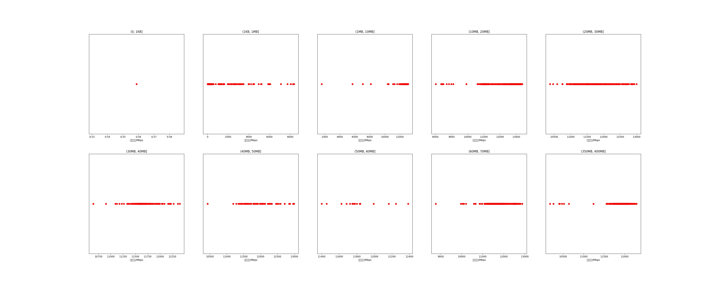

|   |个数|平均大小/MB|速率/Mbps|总时间/s|平均时间/ms|时间占比|
|---|---|---|---|---|---|---|
|(0, 1KB]|1|0.00|0.56|0.02|15.73|0.01%|
|(1KB, 1MB]|627|0.06|554.22|1.08|1.73|0.40%|
|(1MB, 10MB]|83|7.82|12136.80|0.64|7.72|0.24%|
|(10MB, 20MB]|654|16.10|12296.84|10.37|15.86|3.87%|
|(20MB, 30MB]|437|26.51|11764.92|11.81|27.03|4.41%|
|(30MB, 40MB]|229|37.20|11658.94|8.77|38.30|3.27%|
|(40MB, 50MB]|76|46.67|11906.36|3.58|47.11|1.34%|
|(50MB, 60MB]|19|54.90|11827.37|1.06|55.72|0.40%|
|(60MB, 70MB]|500|64.00|11752.34|32.73|65.47|12.21%|
|(350MB, 400MB]|500|392.00|11887.37|197.93|395.87|73.86%|

