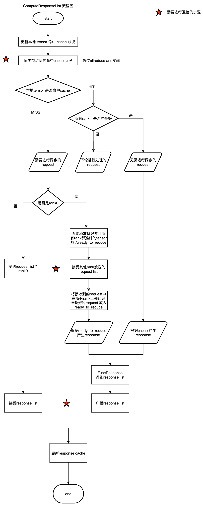
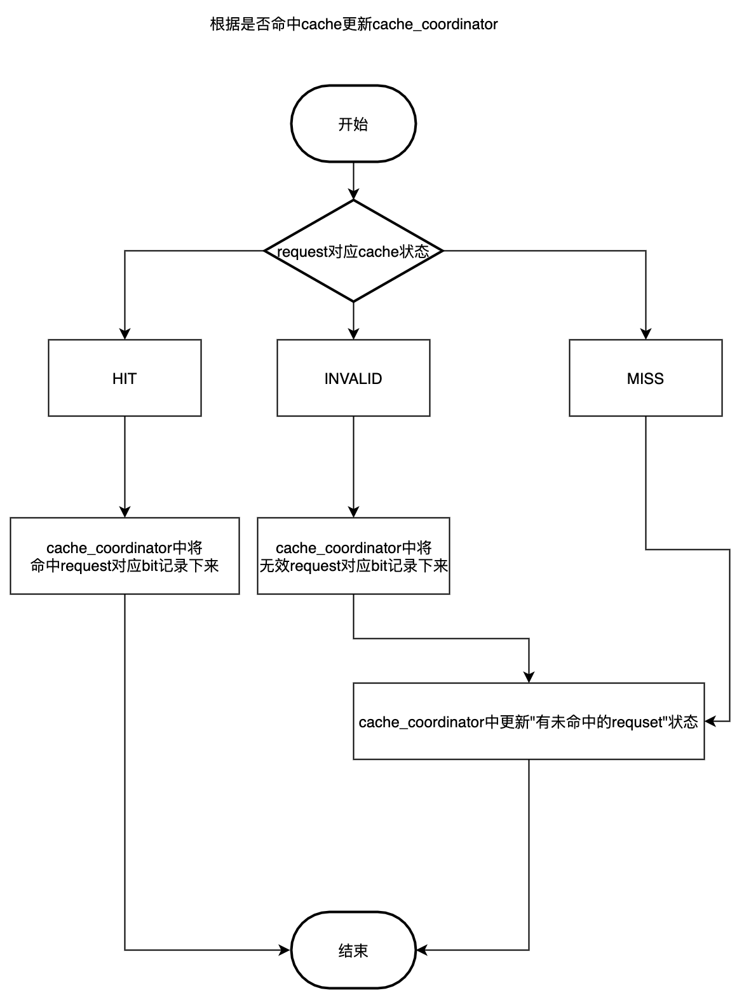
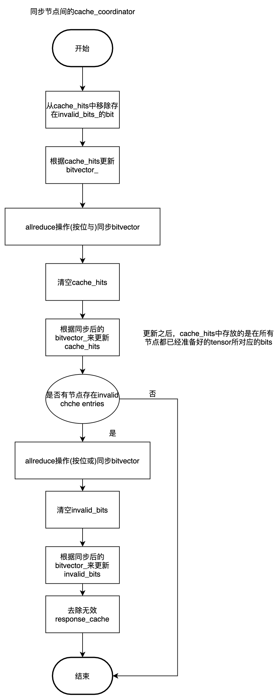

# horoovd 协调过程
# 总流程图

# 协调过程目的
协调过程的目的是决定workers处理哪些tensor，执行哪些操作。
# Response cache
每个worker中存在一个Response Cache，并且每个worker上的Response Cache 的内容是相同的.  Response Cache中存放了被其他rank 发送的tensor 对应的response(计算完成后，发送给coordinator), 如果Response Cache中包含了此轮所有的message， 则不需要额外的communications。

每个worker上cache以std::list<std::pair<Response, TensorParams>> 的形式记录，采用LRU cache.  并利用std::unordered_map<std::string, uint32_t> tensor_name_to_bit_  实现快速寻找cache中的元素

# 协调过程
协调过程具体是对每个workers(包含coordinator)每轮准备好的tensor进行处理，取得在所有worker上都准备好的tensor，然后将request 转换为response，再得到response_list.

workers每轮会有一个准备就绪tensor的队列，准备就绪的tensor会以Request的形式存在每个worker中，称为message_queue。

## 判断request是否命中cache
workers将message_queue中的request 进行判断，判断是否命中cache，并将命中与否的具体信息记录下来。
1. 如果tensor_name_to_bit_ 找不到message中的tensor_name ，则为MISS
2. 如果tensor_name_to_bit_ 中包含message中的tensor_name，并且response参数与TensorParams中的参数都相同，则为HIT
3. 如果tensor_name_to_bit_ 中包含message中的tensor_name，但参数不同，则为INVALID

## 同步worker间的cache状态
因为worker间拥有相同的response cache， 所以可以采用位来映射一个response，减少协调时的数据传输。
每个worker有本地request是否命中cache的记录，这些数据在cache_hits_， 以及invalid_bits_中保存。 cache_hits中保存了命中cache的request所对应的bit(32位), invalid_bits_中保存了invalid request所对应的bits。
每个worker会创建一个bitvector，bitvector中用每一个位 代表此worker是否命中某个response，如果命中，则对应的位的值为1。 bitvector的前三位是存放的StatusBit (SHOULD_SHUT_DOWN, UNCACHED_IN_QUEUE, INVALID_IN_QUEUE), bitvector的大小根据cache中元素的个数加上StatusBit来确定。
所有worker会通过allreduce操作，对bitvecor 进行按位与操作，这样allreduce操作之后，worker上cache_hits_中的元素所对应的request 则是所有worker都准备好的tensor。
同样，按照相似的逻辑，worker通过 allreduce 进行按位或操作，得到所有的invalid bit。
最后 worker上的response cache会删除invalid bit所对应的cache
 worker间会进行allreduce操作（利用bitvector），最终取得在所有workers上都命中cache的request， 以及所有worker中所有的无效的request。 这些信息最终存在在cache_coordinator中。然后每个worker会将无效的response cache去除。

## 划分requset
workers在每轮会将message中的request分为三个部分
1. 在本地命中cache，但是有的rank上没有准备好，这些tensor将在下一轮再进行处理
2. 在本地命中cache，并且在所有的rank上都准备好，这些requese无需再进行协调（称为R1）
3. 没有命中cache ，这些request需要协调（称为R2)

## 判断是够进行同步
接下来判断是否需要进行同步
- 如果开启了cache 并且有不在cache中的cache，即R2不为空，则需要进行同步。

## 无需同步
不需要进行同步，则可直接根据R1来得到response list

## 需要同步
### worker（不包含coordinator) : 
将T2部分的request 即在准备好的tensor所对应的request传递给coordinator
然后接受coordinator广播的response_list

### Coordinator:
得到全部的协调完成的request
  1. 首先处理coordinator中的T2部分，去判断这些tensor是否在所有rank上都已经准备好。
  2. 然后去接受其他worker部分的T2，再去判断是否在所有rank上已经准备好
  3. 上面的两部分整合起来，则是此轮全部的所有节点都准备好的tensor，将这些tensor对应的request放入一个队列，记为ready_to_reduce。

构建response list
  1. 第一部分是所有rank已经准备好并且有cache的tensor对应的request
  2. 第二部分是ready_to_reduce中的tensor
  3. Response fuse
然后通过MPI_Bcast将response list广播出去

然后对每个worker的response cache去进行更新（LRU)策略

## 判断tensor在所有rank上都准备好
判断tensor在所有rank上是否准备好，horovod采取了两种办法
1. 使用response_cache, 在同步worker间的cache状态后，cache_bits_中所对应的request即是所有rank上都准备好的tensor
2. workers 会发送给coordinator request， 每个 tensor 一个 request.  coordinator 将这些request全部存储起来。 对于一个tensor， 每个rank都会产生一个request， 当 coordinator 上已经存储了所有rank的request， 则认为tensor在所有rank上都已经准备好

## fuseResponses
fuseResponses得到response_list 把多个相邻的response里的内容放入一个response对象(需满足如下条件)，再把这些response对象放入ResponseList返回。
1. 执行的操作类型相同
2. 在同一个设备上
3. tensor类型相同
4. tensor大小之和不超过tensor fusion buffer大小
5. prescale_factor和postscale_factor相同

## 问题
1. 什么时候会出现 invalid cache
